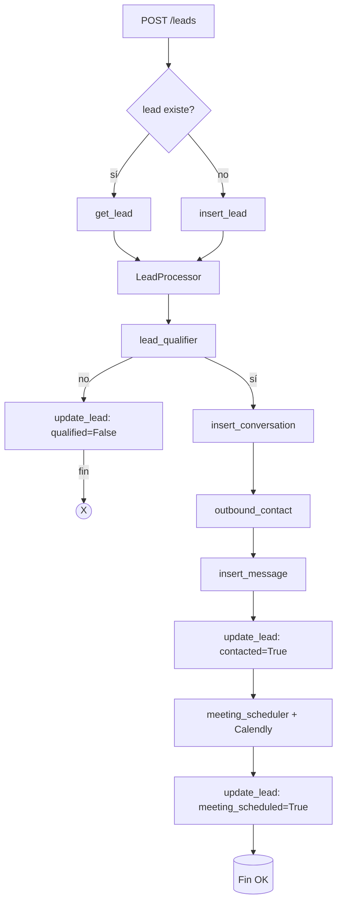

# Lead CRM Agent

Sistema para la gestión y calificación automatizada de leads mediante agentes de IA.

## Flujo del proceso

```mermaid
flowchart TD
    A[POST /leads] --> B{lead existe?}
    B -- sí --> Z[get_lead]
    B -- no --> C[insert_lead]
    Z --> D[LeadProcessor]
    C --> D
    D --> E[lead_qualifier]
    E -- no --> F[update_lead: qualified=False]
    F --> |fin| X((X))
    E -- sí --> G[insert_conversation]
    G --> H[outbound_contact]
    H --> I[insert_message]
    I --> J[update_lead: contacted=True]
    J --> K[meeting_scheduler + Calendly]
    K --> L[update_lead: meeting_scheduled=True]
    L --> M[(Fin OK)]
```
