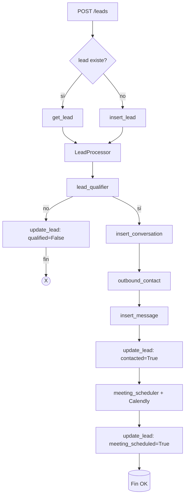

# Pipewise

## The Global Speed-to-Lead Challenge in B2B Companies

**Pipewise** is an intelligent automation solution designed to solve one of the most critical problems in B2B sales: slow response to inbound leads. In today's competitive landscape, the speed at which you respond to a new lead can make or break a deal. Pipewise automates the entire lead journey—from qualification, to personalized outreach, to meeting scheduling—ensuring you never lose a hot lead to slow processes or internal bottlenecks.

---

## Why Speed-to-Lead Matters

**Speed-to-lead** is the time it takes for a company to respond to a new lead. Research shows that:

- The average response time is **47 hours** (almost 2 days).
- Only **27% of leads are ever contacted**.
- **82% of customers expect a response in 10 minutes or less**, but only **7% of companies** respond in under 5 minutes.
- Responding within **5 minutes** increases qualification rates by up to **80%**.
- **78% of buyers purchase from the first responder**.
- Contacting a lead after 30 minutes is **21x less effective** than responding immediately.
- **30% of buyers go to a competitor** if not contacted quickly.

**The cost of slow response:**

- Lost qualified leads and sales opportunities
- Wasted marketing spend (high CAC, low ROI)
- Lower recurring revenue (MRR/ARR) and higher churn
- Internal friction between marketing and sales teams
- Operational bottlenecks and demotivated sales reps

---

## What Problem Does Pipewise Solve?

Pipewise eliminates the "black hole" where leads are lost due to slow, manual, or disconnected processes. It ensures every lead is:

- **Qualified instantly** by AI agents
- **Contacted automatically** with a personalized message
- **Offered a meeting link** to book a call at their convenience
- **Tracked and updated** in your CRM in real time

This means:

- No more leads left waiting for days
- No more wasted marketing budget
- No more lost deals to faster competitors
- No more sales/marketing blame games

---

## Key Benefits

- **Instant 24/7 Response:** Pipewise AI agents engage leads the moment they submit a form—no human delay, no missed opportunities.
- **Massive Scalability:** Handle hundreds or thousands of leads per week without adding headcount. AI never sleeps or gets overwhelmed.
- **Seamless CRM Integration:** All actions (qualification, contact, scheduling) are logged and synced with your CRM.
- **Automated Meeting Scheduling:** Every qualified lead receives a unique Calendly link to book a call, reducing friction and increasing conversion.
- **Proven ROI:** Companies using AI agents like Pipewise report up to **17x ROI**, 300% more conversions, and millions in additional revenue.
- **Faster Time-to-Value:** Go live in days, not months. See results in your pipeline and revenue within weeks.

---

## How Pipewise Works

---

## Dependencies

Pipewise is built with modern, scalable Python tools:

- fastapi
- mcp
- openai
- pydantic[email]
- python-dotenv
- requests
- supabase
- uvicorn

(See `pyproject.toml` for exact versions.)

---

## Summary

Pipewise is the fastest, smartest way to turn leads into customers. By automating qualification, outreach, and scheduling, it ensures you never lose a deal to slow response again. Boost your conversion rates, maximize your marketing ROI, and give your sales team the edge they need—all with a solution that works out of the box and scales with your business.

**Pipewise: Your pipeline, made wise.**
