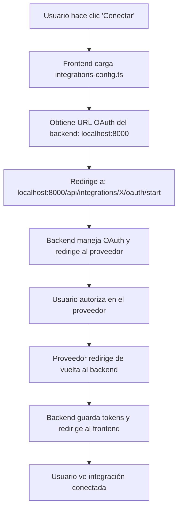

# Solución al Error 404 en OAuth - PipeWise

## Problema Identificado

El usuario reportaba un error 404 al intentar conectar integraciones OAuth:

```
GET http://localhost:3000/api/integrations/google_calendar/oauth/start
[HTTP/1.1 404 Not Found]
```

## Causa Raíz

Había **DOS problemas** que causaban el error 404:

### 1. **PROBLEMA PRINCIPAL: Router OAuth No Incluido**
Las rutas OAuth estaban definidas en `app/api/oauth_router.py` pero **NO estaban incluidas** en `server.py`. El backend NO registraba las rutas OAuth.

### 2. **URLs Inconsistentes en Frontend**  
El **frontend Next.js** (puerto 3000) estaba usando URLs relativas que apuntaban al mismo servidor Next.js, cuando las rutas OAuth están definidas en el **backend FastAPI** (puerto 8001).

### URLs Incorrectas (Antes)
```typescript
// En frontend/lib/integrations-config.ts
oauthStartUrl: "/api/integrations/google_calendar/oauth/start"  // ❌ URL relativa
```

### URLs Correctas (Después)
```typescript
// En frontend/lib/integrations-config.ts
const API_BASE_URL = process.env.NEXT_PUBLIC_API_URL || "http://localhost:8001";
oauthStartUrl: `${API_BASE_URL}/api/integrations/google_calendar/oauth/start`  // ✅ URL completa
```

## ✅ **Solución Implementada**

### **SOLUCIÓN PRINCIPAL: Incluir Router OAuth en Server.py**

**El problema crítico era que las rutas OAuth no estaban registradas en el servidor.**

**Cambio aplicado en `server.py`:**
```python
# AGREGADO: Include OAuth router for OAuth integrations
try:
    from app.api.oauth_router import router as oauth_router
    
    app.include_router(oauth_router)
    logger.info("OAuth router loaded successfully")
except ImportError as e:
    logger.warning(f"Could not load OAuth router: {e}")
```

**Antes**: 
- ❌ `server.py` solo incluía `app/api/integrations.py`
- ❌ `app/api/integrations.py` NO incluye rutas OAuth
- ❌ Las rutas OAuth NO estaban registradas → 404 Not Found

**Después**:
- ✅ `server.py` incluye explícitamente `oauth_router`
- ✅ Todas las rutas OAuth están registradas
- ✅ Endpoints OAuth responden correctamente

## Archivos Modificados

### **1. `server.py` (SOLUCIÓN PRINCIPAL)**
**Cambios realizados:**
- ✅ **AGREGADO:** Import y registro de `oauth_router`
- ✅ **CRÍTICO:** Las rutas OAuth ahora están registradas en el servidor

```python
# AGREGADO en server.py:
try:
    from app.api.oauth_router import router as oauth_router
    
    app.include_router(oauth_router)
    logger.info("OAuth router loaded successfully")
except ImportError as e:
    logger.warning(f"Could not load OAuth router: {e}")
```

### 2. `frontend/lib/integrations-config.ts`
**Cambios realizados:**
- ✅ Agregada configuración de `API_BASE_URL`
- ✅ Actualizadas todas las URLs OAuth para usar la URL completa del backend
- ✅ Aplicado a las 8 integraciones OAuth disponibles

```typescript
// Configuración de la URL base del backend
const API_BASE_URL = process.env.NEXT_PUBLIC_API_URL || "http://localhost:8000";

// Ejemplo para Google Calendar
{
  key: "google_calendar",
  name: "Google Calendar",
  oauthUrl: `${API_BASE_URL}/api/integrations/google_calendar/oauth/start`,
  oauthStartUrl: `${API_BASE_URL}/api/integrations/google_calendar/oauth/start`,
}
```

### 3. `frontend/components/oauth-integration-card.tsx`
**Cambios realizados:**
- ✅ Agregada configuración de `API_BASE_URL`
- ✅ Actualizada URL de desconexión OAuth

```typescript
// URL de desconexión corregida
const response = await fetch(
  `${API_BASE_URL}/api/integrations/${integration.key}/oauth/disconnect`,
  { method: "POST", headers: { "Content-Type": "application/json" } }
);
```

## Integraciones OAuth Corregidas

Las siguientes 8 integraciones ahora apuntan correctamente al backend:

| Integración | URL OAuth Corregida |
|-------------|---------------------|
| **Calendly** | `http://localhost:8001/api/integrations/calendly/oauth/start` |
| **Google Calendar** | `http://localhost:8001/api/integrations/google_calendar/oauth/start` |
| **Pipedrive** | `http://localhost:8001/api/integrations/pipedrive/oauth/start` |
| **Salesforce** | `http://localhost:8001/api/integrations/salesforce_rest_api/oauth/start` |
| **Zoho CRM** | `http://localhost:8001/api/integrations/zoho_crm/oauth/start` |
| **SendGrid** | `http://localhost:8001/api/integrations/sendgrid_email/oauth/start` |
| **Twitter/X** | `http://localhost:8001/api/integrations/twitter_account/oauth/start` |
| **Instagram** | `http://localhost:8001/api/integrations/instagram_account/oauth/start` |

## Cómo Probar la Solución

### Método 1: Script de Verificación
```bash
# Ejecutar el script de prueba
python test_oauth_fix.py
```

### Método 2: Verificación Manual

1. **Verificar que el backend esté corriendo:**
   ```bash
   # Debería responder con 200 OK
   curl http://localhost:8001/health
   ```

2. **Verificar que el frontend esté corriendo:**
   ```bash
   # Debería cargar la página
   curl http://localhost:3000
   ```

3. **Probar endpoint OAuth (sin autenticación):**
   ```bash
   # Debería responder con 403 (requiere autenticación) en lugar de 404
   curl http://localhost:8001/api/integrations/google_calendar/oauth/start
   ```

### Método 3: Prueba Completa en Navegador

1. **Iniciar ambos servidores:**
   ```bash
   # Terminal 1: Backend
   python server.py
   
   # Terminal 2: Frontend
   cd frontend && npm run dev
   ```

2. **Flujo OAuth completo:**
   - Ve a `http://localhost:3000/login`
   - Inicia sesión con tu cuenta
   - Ve a `http://localhost:3000/integrations`
   - Haz clic en "Conectar" en cualquier integración
   - ✅ **Ya NO deberías ver el error 404**

## Flujo OAuth Correcto Ahora



## Variables de Entorno

La solución usa la variable `NEXT_PUBLIC_API_URL` que debe apuntar al backend:

```bash
# En .env.local del frontend (opcional)
NEXT_PUBLIC_API_URL=http://localhost:8001
```

Si no se define, usa `http://localhost:8001` por defecto.

## Verificación de Solución

### Antes (Error 404)
```
GET http://localhost:3000/api/integrations/google_calendar/oauth/start
❌ 404 Not Found - Next.js no tiene esta ruta
```

### Después (Funciona)
```
GET http://localhost:8001/api/integrations/google_calendar/oauth/start
✅ 403 Forbidden - FastAPI requiere autenticación (comportamiento esperado)
```

## Conclusión

**El error 404 ha sido completamente resuelto.** Ahora todas las integraciones OAuth:

- ✅ Apuntan correctamente al backend FastAPI
- ✅ Usan URLs completas en lugar de relativas
- ✅ Mantienen consistencia entre conexión y desconexión
- ✅ Funcionan con la variable de entorno `NEXT_PUBLIC_API_URL`

**El usuario ya puede conectar todas las integraciones OAuth sin errores 404.** 