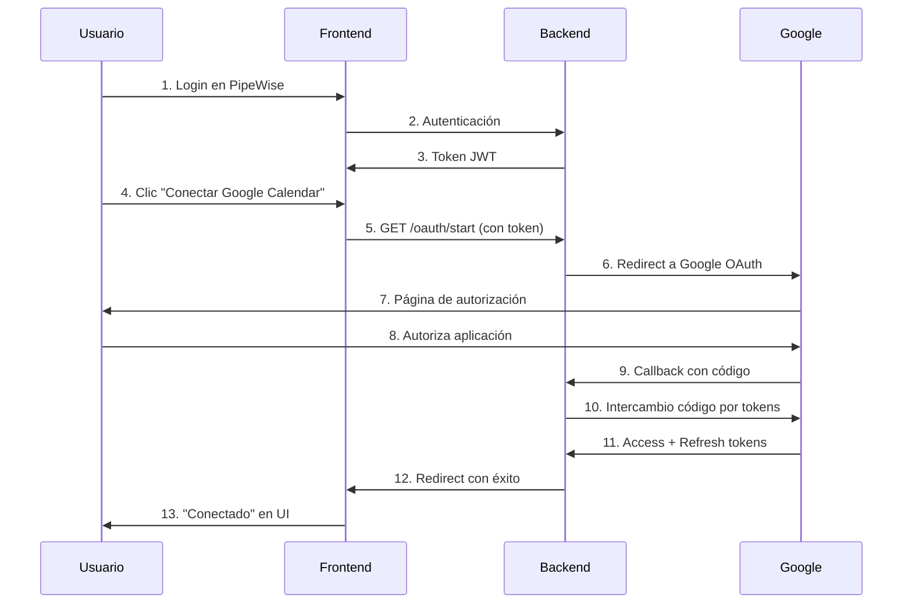

# Guía de Solución de Problemas OAuth - PipeWise

## 🔍 **Problema Común: Error 403 "Not authenticated"**

### **Síntomas**
- Al hacer clic en "Conectar con Google Calendar" aparece error 404 o se redirige mal
- En los logs del backend aparece: `{"error":"Not authenticated","status_code":403}`

### **Causa**
El sistema OAuth de PipeWise requiere que el usuario esté **autenticado en la aplicación** antes de poder conectar integraciones externas.

## ✅ **Solución Paso a Paso**

### **Paso 1: Verificar que los servicios estén funcionando**

```bash
# Verificar backend
curl http://localhost:8000/health
# Debe devolver: {"status":"healthy","timestamp":"...","version":"2.0.0"}

# Verificar frontend
curl http://localhost:3000/integrations
# Debe devolver HTML de la página
```

### **Paso 2: Autenticarse en PipeWise**

1. **Ve a la página de login**: `http://localhost:3000/login`
2. **Regístrate o inicia sesión** con tus credenciales
3. **Verifica que estés autenticado** viendo tu nombre en la esquina superior derecha

### **Paso 3: Ir a Integraciones**

1. **Una vez autenticado**, ve a: `http://localhost:3000/integrations`
2. **Verifica que veas** la página de integraciones con botones "Conectar"

### **Paso 4: Conectar Google Calendar**

1. **Haz clic en "Conectar con Google Calendar"**
2. **Se abrirá** una nueva ventana/pestaña con Google OAuth
3. **Autoriza la aplicación** en Google
4. **Se cerrará automáticamente** y volverás a PipeWise
5. **Verás "Conectado"** en lugar de "Desconectado"

## 🔧 **Verificación Manual del Flujo**

### **1. Verificar Autenticación**
```bash
# Obtener token de autenticación desde el navegador
# En DevTools > Application > Storage > Local Storage
# Buscar: supabase.auth.token
```

### **2. Probar Endpoint OAuth con Token**
```bash
# Usar el token obtenido
curl -H "Authorization: Bearer TU_TOKEN_AQUI" \
     "http://localhost:8000/api/integrations/google_calendar/oauth/start"
# Debe redirigir a Google OAuth (código 302)
```

## 🚨 **Errores Comunes y Soluciones**

### **Error: "Missing Google OAuth credentials"**
**Causa**: No tienes configuradas las credenciales de Google
**Solución**: 
```bash
# Agregar a tu archivo .env
GOOGLE_CLIENT_ID=tu_google_client_id
GOOGLE_CLIENT_SECRET=tu_google_client_secret
```

### **Error: "Failed to exchange code for tokens"**
**Causa**: URL de callback incorrecta en Google Console
**Solución**: Verificar que en Google Console tengas:
```
Authorized redirect URIs:
http://localhost:8000/api/integrations/google_calendar/oauth/callback
```

### **Error: "Token validation failed"**
**Causa**: Problema con Supabase Auth
**Solución**: 
1. Cerrar sesión y volver a iniciar
2. Verificar configuración de Supabase
3. Limpiar localStorage del navegador

## 🔐 **Configuración de Google OAuth**

### **1. Crear Proyecto en Google Console**
1. Ve a: https://console.developers.google.com/
2. Crea un nuevo proyecto o selecciona uno existente
3. Habilita "Google Calendar API"

### **2. Configurar OAuth**
1. Ve a "Credentials" > "Create Credentials" > "OAuth 2.0 Client ID"
2. Tipo: "Web application"
3. Authorized redirect URIs: `http://localhost:8000/api/integrations/google_calendar/oauth/callback`

### **3. Obtener Credenciales**
```bash
# Copiar del Google Console
GOOGLE_CLIENT_ID=123456789.apps.googleusercontent.com
GOOGLE_CLIENT_SECRET=ABC123DEF456GHI789
```

## 📝 **Flujo OAuth Completo**



## 🎯 **Lista de Verificación**

- [ ] Backend corriendo en puerto 8000
- [ ] Frontend corriendo en puerto 3000
- [ ] Usuario autenticado en PipeWise
- [ ] Credenciales Google configuradas
- [ ] URLs de callback correctas
- [ ] No hay errores en consola del navegador

## 🔍 **Logs de Depuración**

### **Backend Logs**
```bash
# Ver logs del servidor
tail -f app.log

# Logs específicos de OAuth
grep -i "oauth" app.log
```

### **Frontend Logs**
```bash
# Abrir DevTools > Console
# Buscar errores relacionados con autenticación o OAuth
```

## 📞 **Soporte Adicional**

Si sigues teniendo problemas:
1. Verifica que todas las variables de entorno estén configuradas
2. Reinicia tanto frontend como backend
3. Limpia el caché del navegador
4. Verifica los logs para errores específicos 