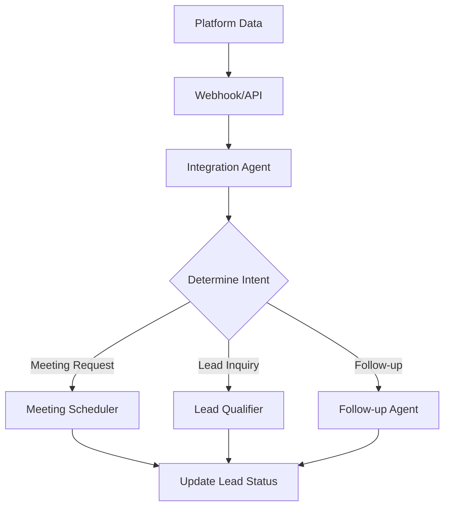
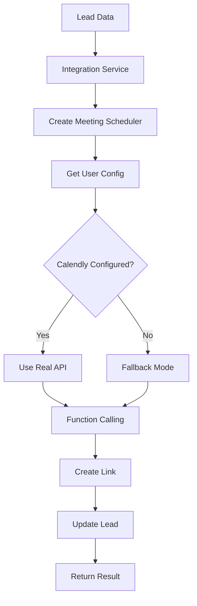

# Integration Architecture

## Overview

PipeWise uses a modular integration architecture that allows seamless communication between different platforms and AI agents. The system is designed to handle incoming data from various sources, process it intelligently, and route it to the appropriate workflow agents.

## Core Components

### 1. Integration Management Layer

```
┌─────────────────────────────────────────────────────────────┐
│                    Integration API                          │
│  (/api/integrations/)                                      │
├─────────────────────────────────────────────────────────────┤
│  - Platform Connections (Calendly, WhatsApp, etc.)        │
│  - Configuration Management                                │
│  - Status Monitoring                                       │
│  - Webhook Handling                                        │
└─────────────────────────────────────────────────────────────┘
```

**Files:**
- `app/api/integrations.py` - API endpoints for integration management
- `app/services/integration_service.py` - Service layer for agent coordination

### 2. Platform Clients

```
┌─────────────────┐  ┌─────────────────┐  ┌─────────────────┐
│  Calendly       │  │  WhatsApp       │  │  Instagram      │
│  Client         │  │  Client         │  │  Client         │
│                 │  │                 │  │                 │
│ - API calls     │  │ - Message       │  │ - DM handling   │
│ - Link creation │  │   handling      │  │ - Mention       │
│ - Event mgmt    │  │ - Lead capture  │  │   tracking      │
└─────────────────┘  └─────────────────┘  └─────────────────┘
```

**Files:**
- `app/agents/tools/calendly.py` - Calendly API client
- Future: WhatsApp, Instagram, Twitter clients

### 3. Agent Layer

```
┌─────────────────────────────────────────────────────────────┐
│                    Integration Agent                        │
│  (Orchestrates platform data and routes to agents)        │
├─────────────────────────────────────────────────────────────┤
│                                                             │
│  ┌─────────────┐  ┌─────────────┐  ┌─────────────┐        │
│  │  Meeting    │  │   Lead      │  │   Follow-up │        │
│  │ Scheduler   │  │ Qualifier   │  │   Agent     │        │
│  │   Agent     │  │   Agent     │  │             │        │
│  └─────────────┘  └─────────────┘  └─────────────┘        │
│                                                             │
└─────────────────────────────────────────────────────────────┘
```

**Files:**
- `app/agents/integration_agent_example.py` - Example integration orchestrator
- `app/agents/meeting_scheduler.py` - Meeting scheduling specialist
- Future: Lead qualifier, follow-up agents

## Data Flow

### 1. Incoming Platform Data



### 2. Meeting Scheduling Flow



## Configuration Management

### User-Specific Configurations

Each user has their own integration configurations stored securely:

```python
user_integrations = {
    "user_123_calendly": {
        "access_token": "encrypted_token",
        "user_name": "John Doe",
        "default_event_type": "Sales Call",
        "status": "connected",
        "stats": {
            "meetings_scheduled": 5,
            "links_created": 10
        }
    },
    "user_123_whatsapp": {
        "api_key": "encrypted_key",
        "phone_number_id": "123456789",
        "status": "connected"
    }
}
```

### Environment Variables

```bash
# Optional default tokens (fallback)
CALENDLY_ACCESS_TOKEN=default_token
WHATSAPP_API_KEY=default_key
OPENAI_API_KEY=required_for_agents
```

## Agent Communication

### Integration Service Pattern

The integration service acts as a coordinator between agents:

```python
from app.services.integration_service import integration_service

# Check what's available for a user
capabilities = integration_service.get_meeting_scheduler_capabilities(user_id)

# Create configured agents
scheduler = integration_service.create_meeting_scheduler(user_id)

# Coordinate workflow
result = await integration_service.schedule_meeting(user_id, lead_data)
```

### Function Calling System

Agents use OpenAI's function calling for complex operations:

```python
# Meeting Scheduler Agent Tools
tools = [
    "get_lead_by_id",
    "create_calendly_scheduling_link", 
    "schedule_meeting_for_lead",
    "get_calendly_event_types",
    "find_best_meeting_slot"
]
```

## Platform-Specific Handlers

### Calendly Integration

```python
class CalendlyHandler:
    def handle_invitee_created(self, data):
        # Meeting was scheduled
        pass
    
    def handle_invitee_canceled(self, data):
        # Meeting was canceled
        pass
```

### WhatsApp Integration

```python
class WhatsAppHandler:
    def handle_message(self, data):
        # Check for meeting keywords
        if self.is_meeting_request(data):
            return await self.schedule_meeting(data)
        
    def is_meeting_request(self, data):
        keywords = ["meeting", "call", "schedule", "demo"]
        return any(word in data["message"]["text"].lower() for word in keywords)
```

## Error Handling Strategy

### Graceful Degradation

1. **Primary**: Use configured integration (e.g., real Calendly)
2. **Fallback**: Use simulated mode (demo links)
3. **Error**: Return meaningful error with fallback options

```python
try:
     # Try real Calendly API
     result = calendly_client.create_link(lead_id)
except (CalendlyAPIError, requests.RequestException, TimeoutError) as e:
    logger.error(f"Calendly API error: {e}")
     # Fall back to demo mode
     result = create_demo_link(lead_id)
     result["fallback"] = True
except Exception as e:
    logger.error(f"Unexpected error in Calendly integration: {e}")
    raise
```

### Error Response Structure

```python
{
    "success": False,
    "error": "Specific error message",
    "fallback_available": True,
    "manual_action_required": False,
    "retry_after": 300  # seconds
}
```

## Scalability Considerations

### 1. Agent Pool Management

```python
# Future: Agent pool for high-volume processing
class AgentPool:
    def __init__(self, agent_type, pool_size=5):
        self.agents = [agent_type() for _ in range(pool_size)]
    
    async def process(self, data):
        agent = await self.get_available_agent()
        return await agent.run(data)
```

### 2. Queue System

```python
# Future: Queue for processing platform events
from celery import Celery

@celery.task
def process_platform_event(platform, event_data):
    agent = IntegrationAgent(user_id=event_data["user_id"])
    return agent.process_incoming_data(platform, event_data)
```

### 3. Caching Strategy

```python
# Cache user configurations and agent instances
from functools import lru_cache

@lru_cache(maxsize=100)
def get_user_integration_config(user_id, platform):
    return fetch_from_database(user_id, platform)
```

## Monitoring and Analytics

### Integration Health Monitoring

```python
class IntegrationMonitor:
    def check_all_integrations(self, user_id):
        status = {}
        for platform in ["calendly", "whatsapp", "instagram"]:
            status[platform] = self.check_integration_health(user_id, platform)
        return status
```

### Usage Analytics

```python
# Track integration usage
{
    "user_id": "user_123",
    "platform": "calendly", 
    "action": "meeting_scheduled",
    "timestamp": "2025-01-07T10:00:00Z",
    "success": True,
    "response_time_ms": 1200
}
```

## Security Model

### Token Management

1. **Encryption**: All API keys/tokens encrypted at rest
2. **Scope Limitation**: Tokens only accessible to owner
3. **Rotation**: Support for token refresh/rotation
4. **Audit**: Log all integration access

### Webhook Security

```python
def verify_webhook(platform, signature, payload):
    """Verify webhook authenticity"""
    if platform == "calendly":
        return verify_calendly_signature(signature, payload)
    elif platform == "whatsapp":
        return verify_whatsapp_signature(signature, payload)
```

## Testing Strategy

### Integration Testing

```python
class TestIntegrationFlow:
    async def test_whatsapp_to_calendly_flow(self):
        # Simulate WhatsApp message
        whatsapp_data = {"message": {"text": "Schedule a demo"}}
        
        # Process through integration agent
        result = await integration_agent.process_incoming_data("whatsapp", whatsapp_data)
        
        # Verify meeting was scheduled
        assert result["success"]
        assert "calendly.com" in result["meeting_url"]
```

### Mock Integrations

```python
class MockCalendlyClient:
    def create_scheduling_link(self, event_type_uri, max_uses=1):
        return {
            "resource": {
                "booking_url": f"https://calendly.com/mock/{uuid4()}",
                "max_event_count": max_uses
            }
        }
```

## Future Enhancements

### 1. Multi-Platform Coordination

```python
# Coordinate actions across platforms
class CrossPlatformCoordinator:
    async def schedule_meeting_with_notifications(self, lead_data):
        # Schedule in Calendly
        meeting = await self.schedule_calendly_meeting(lead_data)
        
        # Send WhatsApp confirmation
        await self.send_whatsapp_confirmation(lead_data, meeting)
        
        # Post to social media
        await self.post_social_update(meeting)
```

### 2. AI-Powered Intent Detection

```python
class IntentDetector:
    def __init__(self):
        self.model = "gpt-4o"
    
    async def detect_intent(self, message):
        # Use AI to determine user intent from message
        pass
```

### 3. Workflow Automation

```python
class WorkflowEngine:
    def create_workflow(self, triggers, actions):
        # Define complex workflows between platforms
        pass
```

This architecture provides a solid foundation for managing integrations while maintaining flexibility for future expansion and customization. 